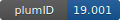

**Project ID:** [plumID:19.001]({{ '/' | absolute_url }}eggs/19/001/)  
**Name:**  RNA SHAPE  
**Archive:** [ https://github.com/srnas/shape-md/archive/476e47196772e5dc109018bc4c2447c5dc234381.zip](https://github.com/srnas/shape-md/archive/476e47196772e5dc109018bc4c2447c5dc234381.zip) [(browse)](https://github.com/srnas/shape-md/tree/476e47196772e5dc109018bc4c2447c5dc234381)  
**Checksum (md5):** 12877107e2d86627750c4461eae5ac38  
**Category:**  bio  
**Keywords:**  metadynamics, RNA, ligand binding  
**PLUMED version:**  2.4  
**Contributor:**  Giovanni Bussi  
**Submitted on:** 10 Apr 2019  
**Publication:** [V. Mlýnský, G. Bussi, Molecular Dynamics Simulations Reveal an Interplay between SHAPE Reagent Binding and RNA Flexibility, The Journal of Physical Chemistry Letters 9, 313–318 (2018)](http://dx.doi.org/10.1021/acs.jpclett.7b02921)  
  
**PLUMED input files**  
  
| File     | Compatible with |  
|:--------:|:--------:|  
| [plumed-g3.dat](./data/plumed-g3.dat.md) |    |  
  
**Last tested:**  11 Jan 2021, 22:56:36
  
**Project description and instructions**  
The zip file contains GROMACS topologies and input files together with a plumed example file. Notice that the simulations in the paper were performed using bias exchange metadynamics, and the example input correspond to a single replica (the one where ligand binding to residue 3 was enhanced). Input files for all replicas should be similarly created in order to run a real simulation.

  
**Submission history**  
**[v1]** 10 Apr 2019: original submission  
  
**Badge**  
Click on the image below and get the code to add the badge to your website!  

  

    &times;
    Markdown<pre></pre>
    HTML<pre>&lt;a href="https://www.plumed-nest.org/eggs/19/001/"&gt;&lt;img src="https://www.plumed-nest.org/eggs/19/001/badge.svg" alt="plumID:19.001"&gt;&lt;/a&gt;</pre>
  

