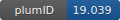

**Project ID:** [plumID:19.039]({{ '/' | absolute_url }}eggs/19/039/)  
**Name:**  Funnel Metadynamics  
**Archive:** [ https://github.com/limresgrp/FMAP_v1/raw/master/input_example.zip](https://github.com/limresgrp/FMAP_v1/raw/master/input_example.zip)  
**Category:**  bio  
**Keywords:**  funnel-metadynamics, absolute binding free energy, ligand-receptor complexes  
**PLUMED version:**  2.6-dev  
**Contributor:**  Vittorio Limongelli  
**Submitted on:** 07 May 2019  
**Last revised:** 21 Feb 2020  
**Publication:** [V. Limongelli, M. Bonomi, M. Parrinello, Funnel metadynamics as accurate binding free-energy method. Proceedings of the National Academy of Sciences. 110, 6358–6363 (2013)](http://dx.doi.org/10.1073/pnas.1303186110)  
  
**PLUMED input files**  
  
| File     | Compatible with |  
|:--------:|:--------:|  
| [plumed.dat](./data/plumed.dat.md) |    |  
  
**Last tested:**  03 Feb 2026, 21:32:56
  
**Project description and instructions**  
Funnel-Metadynamics has been incorporated in PLUMED as a module. Please follow the instructions on how to install modules in PLUMED and add --enable-modules=funnel to configure PLUMED with Funnel-Metadynamics.

  

<b><a href="https://www.plumed.org/doc-master/user-doc/html/actionlist/?actions=PRINT,DISTANCE,UPPER_WALLS,WHOLEMOLECULES,RMSD,LOWER_WALLS,COM,FUNNEL_PS,METAD,FUNNEL" target="_blank">Click here</a> to open manual pages for actions used in this project.</b>

**Submission history**  
**[v1]** 07 May 2019: original submission  
**[v2]** 21 Feb 2020: separate module  
  
**Badge**  
Click on the image below and get the code to add the badge to your website!  

  

    &times;
    Markdown<pre></pre>
    HTML<pre>&lt;a href="https://www.plumed-nest.org/eggs/19/039/"&gt;&lt;img src="https://www.plumed-nest.org/eggs/19/039/badge.svg" alt="plumID:19.039"&gt;&lt;/a&gt;</pre>
  

