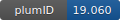

**Project ID:** [plumID:19.060]({{ '/' | absolute_url }}eggs/19/060/)  
**Name:**  Neural networks-based variationally enhanced sampling  
**Archive:** [ https://github.com/luigibonati/deep-ves-data/raw/master/deep-ves-data.zip](https://github.com/luigibonati/deep-ves-data/raw/master/deep-ves-data.zip)  
**Category:**  methods  
**Keywords:**  ves, neural networks  
**PLUMED version:**  2.5-mod  
**Contributor:**  Luigi Bonati  
**Submitted on:** 01 Aug 2019  
**Last revised:** 19 Aug 2019  
**Publication:** [L. Bonati, Y.-Y. Zhang, M. Parrinello, Neural networks-based variationally enhanced sampling, Proceedings of the National Academy of Sciences 116, 17641–17647 (2019)](http://dx.doi.org/10.1073/pnas.1907975116)  
  
**PLUMED input files**  
  
| File     | Compatible with |  
|:--------:|:--------:|  
| [...e_quapp_potential/single_replica/inputs/plumed.dat](./data/1_wolfe_quapp_potential/single_replica/inputs/plumed.dat.md) |     |  
| [2_ala2/simulation/plumed.dat](./data/2_ala2/simulation/plumed.dat.md) |     |  
| [3_ala4/simulation/plumed.dat](./data/3_ala4/simulation/plumed.dat.md) |     |  
| [4_silicon/plumed.dat](./data/4_silicon/plumed.dat.md) |     |  
  
**Last tested:**  11 Jan 2021, 22:51:00
  
**Project description and instructions**  
Code, input files, and example results of the DEEP-VES method, as presented in the paper [Neural networks-based variationally enhanced sampling](https://doi.org/10.1073/pnas.1907975116). More information about the content can be found [here](https://github.com/luigibonati/deep-ves-data/blob/master/README.md). Please note that the code requires LibTorch to work. As of now it is provided without documentation since we are still working on it. We plan to release it in PLUMED soon.

  
**Submission history**  
**[v1]** 01 Aug 2019: original submission  
**[v2]** 19 Aug 2019: updated doi  
  
**Badge**  
Click on the image below and get the code to add the badge to your website!  

  

    &times;
    Markdown<pre></pre>
    HTML<pre>&lt;a href="https://www.plumed-nest.org/eggs/19/060/"&gt;&lt;img src="https://www.plumed-nest.org/eggs/19/060/badge.svg" alt="plumID:19.060"&gt;&lt;/a&gt;</pre>
  

