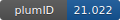

**Project ID:** [plumID:21.022]({{ '/' | absolute_url }}eggs/21/022/)  
**Name:**  Predictive theoretical framework for dynamic control of bio-inspired hybrid nanoparticle self-assembly  
**Archive:** [ https://github.com/xinqiz/SiNP-Car9-paper1/raw/main/SiNP_Car9.zip](https://github.com/xinqiz/SiNP-Car9-paper1/raw/main/SiNP_Car9.zip)  
**Category:**  materials  
**Keywords:**  parallel bias metadynamics, adsorption, peptide  
**PLUMED version:**  2.4  
**Contributor:**  Xin Qi  
**Submitted on:** 09 May 2021  
**Publication:** unpublished  
  
**PLUMED input files**  
  
| File     | Compatible with |  
|:--------:|:--------:|  
| [SiNP_Car9/plumed.dat](./data/SiNP_Car9/plumed.dat.md) |    |  
  
**Last tested:**  22 Jul 2021, 08:48:56
  
**Project description and instructions**  
Tested with GROMACS 2018 and PLUMED 2.4. 

  
**Submission history**  
**[v1]** 09 May 2021: original submission  
  
**Badge**  
Click on the image below and get the code to add the badge to your website!  

  

    &times;
    Markdown<pre></pre>
    HTML<pre>&lt;a href="https://www.plumed-nest.org/eggs/21/022/"&gt;&lt;img src="https://www.plumed-nest.org/eggs/21/022/badge.svg" alt="plumID:21.022"&gt;&lt;/a&gt;</pre>
  

