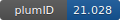

**Project ID:** [plumID:21.028]({{ '/' | absolute_url }}eggs/21/028/)  
**Name:**  From Enhanced Sampling to Reaction Profiles  
**Archive:** [ https://github.com/EnricoTrizio/TargetedDiscriminantAnalysisCVs/archive/refs/heads/main.zip](https://github.com/EnricoTrizio/TargetedDiscriminantAnalysisCVs/archive/refs/heads/main.zip)  
**Category:**  methods  
**Keywords:**  collective variables, multi-state, machine learning, Deep-TDA  
**PLUMED version:**  2.7  
**Contributor:**  Enrico Trizio  
**Submitted on:** 06 Jul 2021  
**Publication:** unpublished  
  
**PLUMED input files**  
  
| File     | Compatible with |  
|:--------:|:--------:|  
| [OAMe_G2/deepDA_enhanced_sampling/plumed.dat](./data/OAMe_G2/deepDA_enhanced_sampling/plumed.dat.md) |     |  
| [OAMe_G2/deepTDA_enhanced_sampling/plumed.dat](./data/OAMe_G2/deepTDA_enhanced_sampling/plumed.dat.md) |     |  
| [OAMe_G2/unbiased/bound/plumed.dat](./data/OAMe_G2/unbiased/bound/plumed.dat.md) |    |  
| [OAMe_G2/unbiased/unbound/plumed.dat](./data/OAMe_G2/unbiased/unbound/plumed.dat.md) |    |  
| [alanine/deepDA_enhanced_sampling/plumed.dat](./data/alanine/deepDA_enhanced_sampling/plumed.dat.md) |     |  
| [alanine/deepTDA_enhanced_sampling/plumed.dat](./data/alanine/deepTDA_enhanced_sampling/plumed.dat.md) |     |  
| [benzoquinone_PT/1_unbiased/plumed.dat](./data/benzoquinone_PT/1_unbiased/plumed.dat.md) |    |  
| [benzoquinone_PT/2_biased/plumed.dat](./data/benzoquinone_PT/2_biased/plumed.dat.md) |     |  
| [hBromination/1D_deepTDA/plumed.dat](./data/hBromination/1D_deepTDA/plumed.dat.md) |     |  
| [hBromination/2D_deepTDA/plumed.dat](./data/hBromination/2D_deepTDA/plumed.dat.md) |     |  
| [hBromination/unbiased/plumed.dat](./data/hBromination/unbiased/plumed.dat.md) |     |  
  
**Last tested:**  22 Jul 2021, 08:46:49
  
**Project description and instructions**  
This egg contains the input files to reproduce the simulations with Deep-TDA CV of alanine folding, a calyxarene host-guest system in explicit solvent, the multi-state hydrobromination of propene and a step-wise intramolecular double proton transfer reaction. The Deep-TDA CV is expressed as the output of a feed-forward neural network trained imposing that the configurations in the different minima are distributed in the projected CV space according to a preassigned target distribution. Note that the build fails because PLUMED needs to be manually compiled with Libtorch to import the trained model from Pytorch with the interface from [Bonati et al., J. Phys. Chem. Lett., 2020, 11, 2998–3004](https://pubs.acs.org/doi/abs/10.1021/acs.jpclett.0c00535). We have made available a Google Colab Notebook [here](https://colab.research.google.com/drive/1TO7bAkmIznsdfea2i5NXfNtytJrnkkIt?usp=sharing) with a tutorial for the training of the Deep-TDA CV and indications on the PLUMED configuration required. The input files for the training are also included in this egg.

  
**Submission history**  
**[v1]** 06 Jul 2021: original submission  
  
**Badge**  
Click on the image below and get the code to add the badge to your website!  

  

    &times;
    Markdown<pre></pre>
    HTML<pre>&lt;a href="https://www.plumed-nest.org/eggs/21/028/"&gt;&lt;img src="https://www.plumed-nest.org/eggs/21/028/badge.svg" alt="plumID:21.028"&gt;&lt;/a&gt;</pre>
  

