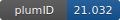

**Project ID:** [plumID:21.032]({{ '/' | absolute_url }}eggs/21/032/)  
**Name:**  Metal-coupled folding mechanism to metallothionein  
**Archive:** [ https://github.com/ManuelPerisDiaz/Plumed/raw/main/PLUMED-NEST.zip](https://github.com/ManuelPerisDiaz/Plumed/raw/main/PLUMED-NEST.zip)  
**Category:**  bio  
**Keywords:**  parallel bias metadynamics, well tempered metadynamics, metal binding, metalloprotein, zinc coordination  
**PLUMED version:**  2.6  
**Contributor:**  Manuel Peris Diaz  
**Submitted on:** 21 Jul 2021  
**Publication:** unpublished  
  
**PLUMED input files**  
  
| File     | Compatible with |  
|:--------:|:--------:|  
| [plumed_PB_WTMetad.dat](./data/plumed_PB_WTMetad.dat.md) |    |  
| [plumed_fes_1_2.dat](./data/plumed_fes_1_2.dat.md) |    |  
| [plumed_reweight.dat](./data/plumed_reweight.dat.md) |    |  
| [plumed_water.dat](./data/plumed_water.dat.md) |    |  
  
**Last tested:**  22 Jul 2021, 08:45:59
  
**Project description and instructions**  
The directory contain input files for GROMACS/PLUMED simulation and reweighing. 

  
**Submission history**  
**[v1]** 21 Jul 2021: original submission  
  
**Badge**  
Click on the image below and get the code to add the badge to your website!  

  

    &times;
    Markdown<pre></pre>
    HTML<pre>&lt;a href="https://www.plumed-nest.org/eggs/21/032/"&gt;&lt;img src="https://www.plumed-nest.org/eggs/21/032/badge.svg" alt="plumID:21.032"&gt;&lt;/a&gt;</pre>
  

