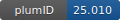

**Project ID:** [plumID:25.010]({{ '/' | absolute_url }}eggs/25/010/)  
**Name:**  Kinetic rates calculation with Ratchet&Pawl MD  
**Archive:** [ https://github.com/riccardocapelli/papers_data/raw/refs/heads/master/rMD_kinetics2025/input_data.zip](https://github.com/riccardocapelli/papers_data/raw/refs/heads/master/rMD_kinetics2025/input_data.zip)  
**Category:**  methods  
**Keywords:**  kinetics, ligand binding, ABMD, ratchet&pawl MD  
**PLUMED version:**  2.9  
**Contributor:**  Riccardo Capelli  
**Submitted on:** 15 Apr 2025  
**Publication:** unpublished  
  
**PLUMED input files**  
  
| File     | Compatible with |  
|:--------:|:--------:|  
| [input_plumed/plumed_aa.dat](./data/input_plumed/plumed_aa.dat.md) |    |  
| [input_plumed/plumed_mego.dat](./data/input_plumed/plumed_mego.dat.md) |    |  
  
**Last tested:**  03 Feb 2026, 21:03:16
  
**Project description and instructions**  
All the input files for GROMACS (we used the 2024.4 version), PLUMED, and the analysis scripts are in the archive. 

  

<b><a href="https://www.plumed.org/doc-master/user-doc/html/actionlist/?actions=PRINT,COM,FLUSH,GROUP,DISTANCE,ABMD,WHOLEMOLECULES,COMMITTOR" target="_blank">Click here</a> to open manual pages for actions used in this project.</b>

**Submission history**  
**[v1]** 15 Apr 2025: original submission  
  
**Badge**  
Click on the image below and get the code to add the badge to your website!  

  

    &times;
    Markdown<pre></pre>
    HTML<pre>&lt;a href="https://www.plumed-nest.org/eggs/25/010/"&gt;&lt;img src="https://www.plumed-nest.org/eggs/25/010/badge.svg" alt="plumID:25.010"&gt;&lt;/a&gt;</pre>
  

