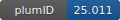

**Project ID:** [plumID:25.011]({{ '/' | absolute_url }}eggs/25/011/)  
**Name:**  Chiral perovskite nucleation  
**Archive:** [ https://github.com/adpietropaolo/plumed-nest-data/raw/master/ChiralPerovskiteNucleation.zip](https://github.com/adpietropaolo/plumed-nest-data/raw/master/ChiralPerovskiteNucleation.zip)  
**Category:**  chemistry  
**Keywords:**  metadynamics, chiral perovskites, nucleation  
**PLUMED version:**  2.9  
**Contributor:**  Adriana Pietropaolo  
**Submitted on:** 12 May 2025  
**Publication:** [M. Fortino, G. Schifino, M. Salvalaglio, A. Pietropaolo, Stepwise kinetics of the early-stage nucleation in chiral perovskites via ab initio molecular dynamics and free-energy calculations. Nanoscale. 17, 5823–5828 (2025)](http://dx.doi.org/10.1039/D4NR04735D)  
  
**PLUMED input files**  
  
| File     | Compatible with |  
|:--------:|:--------:|  
| [ChiralPerovskiteNucleation/plumed.dat](./data/ChiralPerovskiteNucleation/plumed.dat.md) |    |  
  
**Last tested:**  03 Feb 2026, 21:03:01
  
**Project description and instructions**  
The folder provides the data to simulate the nucleation of chiral perovskites and contains the two pdb files of the two chiral ligands and the plumed input file.:w

  

<b><a href="https://www.plumed.org/doc-master/user-doc/html/actionlist/?actions=PBMETAD,RESTART,DISTANCE,MULTI_RMSD,UPPER_WALLS,LOWER_WALLS,UNITS,PRINT,MATHEVAL" target="_blank">Click here</a> to open manual pages for actions used in this project.</b>

**Submission history**  
**[v1]** 12 May 2025: original submission  
  
**Badge**  
Click on the image below and get the code to add the badge to your website!  

  

    &times;
    Markdown<pre></pre>
    HTML<pre>&lt;a href="https://www.plumed-nest.org/eggs/25/011/"&gt;&lt;img src="https://www.plumed-nest.org/eggs/25/011/badge.svg" alt="plumID:25.011"&gt;&lt;/a&gt;</pre>
  

