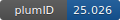

**Project ID:** [plumID:25.026]({{ '/' | absolute_url }}eggs/25/026/)  
**Name:**  Deciphering the Molecular Mechanisms of Startle Disease - the Role of the Asn46Lys Mutation in the Glycine Receptor  
**Archive:** [ https://github.com/jacobclarktes/plumed_nest-Funnel-N46K/raw/refs/heads/main/plumed-nest.zip](https://github.com/jacobclarktes/plumed_nest-Funnel-N46K/raw/refs/heads/main/plumed-nest.zip)  
**Category:**  bio  
**Keywords:**  metadynamics, glycine receptors, funnel metadynamics  
**PLUMED version:**  2.7  
**Contributor:**  Jacob Adam Clark  
**Submitted on:** 30 Aug 2025  
**Publication:** [J. A. Clark, G. Xue, C. Molteni, Deciphering the Molecular Mechanisms of Startle Disease: the Role of the N46K Mutation in the Glycine Receptor (2025)](http://dx.doi.org/10.26434/chemrxiv-2025-mr5rn)  
  
**PLUMED input files**  
  
| File     | Compatible with |  
|:--------:|:--------:|  
| [Mutant_inputs/plumed_F1.dat](./data/Mutant_inputs/plumed_F1.dat.md) |    |  
| [Wildtype_inputs/plumed_F1.dat](./data/Wildtype_inputs/plumed_F1.dat.md) |    |  
  
**Last tested:**  03 Feb 2026, 21:03:55
  
**Project description and instructions**  
Simulations were carried out using the 2.14 patched with PLUMED 2.7. 

  

<b><a href="https://www.plumed.org/doc-master/user-doc/html/actionlist/?actions=PRINT,UPPER_WALLS,LOWER_WALLS,COM,FUNNEL_PS,METAD,FUNNEL" target="_blank">Click here</a> to open manual pages for actions used in this project.</b>

**Submission history**  
**[v1]** 30 Aug 2025: original submission  
  
**Badge**  
Click on the image below and get the code to add the badge to your website!  

  

    &times;
    Markdown<pre></pre>
    HTML<pre>&lt;a href="https://www.plumed-nest.org/eggs/25/026/"&gt;&lt;img src="https://www.plumed-nest.org/eggs/25/026/badge.svg" alt="plumID:25.026"&gt;&lt;/a&gt;</pre>
  

