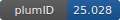

**Project ID:** [plumID:25.028]({{ '/' | absolute_url }}eggs/25/028/)  
**Name:**  Designing transferable transition state guided collective variable via interpretable machine learning model for enhanced sampling. A case study on polymer collapse transition  
**Archive:** [ https://github.com/saikat-ai/polymer_enhanced_sampling/archive/refs/heads/main.zip](https://github.com/saikat-ai/polymer_enhanced_sampling/archive/refs/heads/main.zip)  
**Category:**  bio  
**Keywords:**  metadynamics, polymer collapse transition, transferable CV,interpretable ML-model  
**PLUMED version:**  2.7  
**Contributor:**  Saikat Dhibar and Biman Jana  
**Submitted on:** 28 Oct 2025  
**Publication:** unpublished  
  
**PLUMED input files**  
  
| File     | Compatible with |  
|:--------:|:--------:|  
| [C60/plumed1.dat](./data/C60/plumed1.dat.md) |    |  
| [C60/plumed_rg.dat](./data/C60/plumed_rg.dat.md) |    |  
| [C80/plumed1.dat](./data/C80/plumed1.dat.md) |    |  
  
**Last tested:**  03 Feb 2026, 21:01:33
  
**Project description and instructions**  
Simulations were performed with GROMACS 2020.6 and plumed 2.7.3. 

  

<b><a href="https://www.plumed.org/doc-master/user-doc/html/actionlist/?actions=GROUP,GYRATION,LOWER_WALLS,WHOLEMOLECULES,COORDINATION,MATHEVAL,PRINT,METAD,CENTER,DISTANCE,COMBINE,UPPER_WALLS" target="_blank">Click here</a> to open manual pages for actions used in this project.</b>

**Submission history**  
**[v1]** 28 Oct 2025: original submission  
  
**Badge**  
Click on the image below and get the code to add the badge to your website!  

  

    &times;
    Markdown<pre></pre>
    HTML<pre>&lt;a href="https://www.plumed-nest.org/eggs/25/028/"&gt;&lt;img src="https://www.plumed-nest.org/eggs/25/028/badge.svg" alt="plumID:25.028"&gt;&lt;/a&gt;</pre>
  

