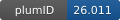

**Project ID:** [plumID:26.011]({{ '/' | absolute_url }}eggs/26/011/)  
**Name:**  Lets Stalk About Membranes. Committor-Based Enhanced Sampling of Stalk Formation.  
**Archive:** [ https://github.com/giorgiarossii/membrane_fusion_committor/releases/download/plumed-nest-v1/membrane_fusion_committor_plumed_inputs.zip](https://github.com/giorgiarossii/membrane_fusion_committor/releases/download/plumed-nest-v1/membrane_fusion_committor_plumed_inputs.zip)  
**Category:**  bio  
**Keywords:**  committor, machine learning, enhanced sampling, OPES, membrane fusion, stalk formation, nanoparticles  
**PLUMED version:**  2.9  
**Contributor:**  Giorgia Rossi  
**Submitted on:** 10 Aug 2026  
**Publication:** unpublished  
  
**PLUMED input files**  
  
| File     | Compatible with |  
|:--------:|:--------:|  
| [biased/plumed.dat](./data/biased/plumed.dat.md) |     |  
  
**Last tested:**  22 Aug 2026, 14:29:22
  
**Project description and instructions**  
The archive contains the PLUMED input, trained committor model, GROMACS index, and custom PLUMED actions. The input was developed and tested with PLUMED 2.9.4 compiled with LibTorch support. The custom actions are compiled automatically using LOAD action.

  

<b><a href="https://www.plumed.org/doc-master/user-doc/html/actionlist/?actions=LOWER_WALLS,GROUP,LOAD,BIASVALUE,OPES_METAD_EXPLORE,CUSTOM,CENTER,COORDINATION,PRINT" target="_blank">Click here</a> to open manual pages for actions used in this project.</b>

**Submission history**  
**[v1]** 10 Aug 2026:   
  
**Badge**  
Click on the image below and get the code to add the badge to your website!  

  

    &times;
    Markdown<pre></pre>
    HTML<pre>&lt;a href="https://www.plumed-nest.org/eggs/26/011/"&gt;&lt;img src="https://www.plumed-nest.org/eggs/26/011/badge.svg" alt="plumID:26.011"&gt;&lt;/a&gt;</pre>
  

